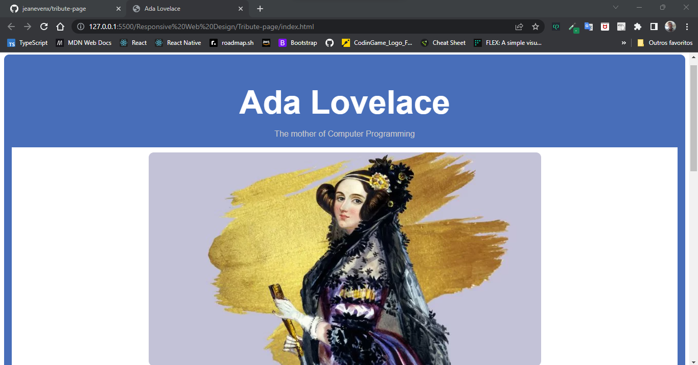

# Tribute Page

  

### FreeCodeCamp's first responsive web design project based on the following user stories.
  

1. Your tribute page should have a <strong>main</strong> element with a corresponding <strong>id</strong> of <strong>main</strong>, which contains all other elements.
   
2. You should see an element with an <strong>id</strong> of <strong>title</strong>, which contains a string (i.e. text), that describes the subject of the tribute page (e.g. "Dr. Norman Borlaug")
   
3. You should see either a <strong>figure</strong> or a <strong>div</strong> element with an <strong>id</strong> of <strong>img-div</strong>
   
4. Within the <strong>#img-div</strong> element, you should see an <strong>img</strong> element with a corresponding <strong>id="image"</strong>
   
5. Within the <strong>#img-div</strong> element, you should see an element with a corresponding <strong>id="img-caption"</strong> that contains textual content describing the image shown in <strong>#img-div</strong>
   
6. You should see an element with a corresponding <strong>id="tribute-info"</strong>, which contains textual
   
7. You should see an <strong>a</strong> element with a corresponding <strong>id="tribute-link"</strong>, which links to an outside site, that contains additional information about the subject of the tribute page. HINT: You must give your element an attribute of <strong>target</strong> and set it to <strong>_blank</strong> in order for your link to open in a new tab
   
8. Your <strong>#image</strong> should use <strong>max-width</strong> and <strong>height</strong> properties to resize responsively, relative to the width of its parent element, without exceeding its original size
   
9.  Your <strong>img</strong> element should be centered within its parent element
